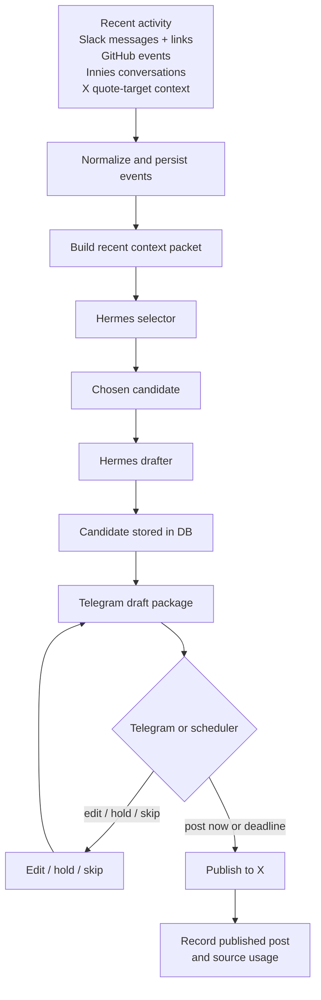

# auto-biographer

Auto-biographer turns recent activity into reviewable X posts.

It pulls signal from things like Slack, GitHub, Innies conversations, and X context, builds a fresh context packet, runs Hermes to select the best posting opportunity, drafts the post, sends it to Telegram for control, and publishes to X when approved or due.

## Current State

- Live, single-user system running on EC2
- X is the only publishing target today
- Telegram is the control surface for review, edit, hold, skip, and post-now
- Hermes is used for both selection and drafting
- GitHub, Slack, Innies, and X quote-target context feed the selector
- Optional Telegram photo replies can be attached at publish time
- Publishing records source usage so the system avoids recycling the same context repeatedly

## Flow



## Local Setup

```bash
cd /Users/dylanvu/auto-biographer
pnpm install
```

Copy `.env.example` into your local environment before running commands.

## Commands

```bash
pnpm test
pnpm typecheck
pnpm cli -- migrate
pnpm cli -- draft-now
pnpm cli -- tick
```
